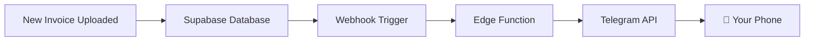

# 📱 Mobile Notifications for Invoice System

## What I Created For You

I've set up **multiple notification options** for your invoice system. Choose the one that fits your needs best!

---

## 📁 Files Created

### 1. **Telegram Bot Notification** (Recommended ⭐)
- `supabase/functions/notify-telegram/index.ts` - Edge function for Telegram
- `QUICK_TELEGRAM_SETUP.md` - 5-minute setup guide
- `NOTIFICATION_SETUP.md` - Complete setup guide with all options

### 2. **Browser Notifications**
- `src/components/NotificationSettings.tsx` - React component for managing notifications
- `src/routes/admin.notification-settings.tsx` - Admin page for notification settings

### 3. **Database Setup**
- `supabase/migrations/create_invoice_notification_trigger.sql` - Database trigger (optional)

---

## 🚀 Quick Start (Choose One)

### Option A: Telegram Bot (⚡ Fastest - 5 minutes)

**Best for:** Getting started quickly, works on all devices

**Setup:**
1. Open `QUICK_TELEGRAM_SETUP.md`
2. Follow the 5 steps
3. Done! You'll get notifications on your phone instantly

**Pros:**
✅ Works immediately
✅ No app installation needed
✅ Free forever
✅ Reliable

---

### Option B: Browser Notifications (🌐 For PWA)

**Best for:** When you're already using the web app

**Setup:**
1. Add notification settings page to your navigation
2. Visit the page and click "Enable Notifications"
3. Notifications will appear when browser is open

**How to add to navigation:**

In your admin navigation menu (e.g., `src/components/Navigation.tsx`), add:

```typescript
import { Bell } from "lucide-react";

// In your navigation items:
{
  path: "/admin/notification-settings",
  label: "Notifikace",
  icon: <Bell className="h-5 w-5" />,
}
```

**Pros:**
✅ Native browser notifications
✅ Works offline (PWA)
✅ No third-party service needed

**Cons:**
❌ Only works when browser is open
❌ Doesn't work on iOS Safari

---

## 🎯 My Recommendation

**Start with Telegram Bot** because:
1. Takes only 5 minutes to set up
2. Works everywhere (iOS, Android, Desktop, Web)
3. Notifications arrive even when app is closed
4. Free and unlimited
5. Can share with your team easily

**Later, add Browser Notifications** for when you're actively using the app.

---

## 📱 How It Works



When someone uploads an invoice:
1. **Invoice saved** to `invoices_received` table
2. **Webhook triggers** automatically
3. **Edge Function** formats the notification
4. **Telegram sends** message to your phone
5. **You receive** notification within 1-2 seconds

---

## 🔧 Setup Instructions

### For Telegram (Recommended):

```bash
# 1. Read the quick setup guide
cat QUICK_TELEGRAM_SETUP.md

# 2. Deploy the Edge Function
supabase functions deploy notify-telegram

# 3. Set your secrets (get these from @BotFather on Telegram)
supabase secrets set TELEGRAM_BOT_TOKEN=your_token_here
supabase secrets set TELEGRAM_CHAT_ID=your_chat_id_here

# 4. Test it
supabase functions invoke notify-telegram --method POST --body '{
  "type": "INSERT",
  "record": {
    "table": "invoices_received",
    "invoice_number": "TEST-001",
    "supplier_id": "test",
    "total_amount": 1500,
    "invoice_date": "2025-11-05",
    "items_count": 3
  }
}'
```

### For Browser Notifications:

1. **Add the route to your app:**

In your `src/App.tsx` or routing file, add:
```typescript
import NotificationSettingsPage from "@/routes/admin.notification-settings";

// In your routes:
<Route path="/admin/notification-settings" element={<NotificationSettingsPage />} />
```

2. **Navigate to the page** and enable notifications

3. **Done!** Notifications will appear automatically

---

## 🎨 Notification Preview

### Telegram Message:
```
🧾 Nová faktura přijata!

📦 Dodavatel: MAKRO Cash & Carry
📄 Číslo faktury: FAK-2025-1234
💰 Částka: 15,420.50 Kč
📅 Datum: 05.11.2025
📊 Počet položek: 12

✅ Připraveno ke zpracování
```

### Browser Notification:
```
🧾 Nová faktura
MAKRO Cash & Carry - 15,420.50 Kč
```

---

## 🔔 What Gets Notified

Currently configured to notify when:
- ✅ **New invoice uploaded** (`INSERT` on `invoices_received`)

### Want to add more notifications?

You can easily extend to notify for:
- 📝 New order created
- ✅ Order status changed
- 🚚 Order dispatched
- ⚠️ Low stock alerts
- 💰 Daily sales summary
- 📊 Weekly reports

Just modify the Edge Function to listen to different tables!

---

## 👥 Team Notifications

### Share with your team:

**Option 1: Telegram Group**
1. Create a Telegram group
2. Add your bot to the group
3. Get the group chat ID
4. Update `TELEGRAM_CHAT_ID` with the group ID

**Option 2: Multiple Recipients**
Modify the Edge Function to send to multiple chat IDs:

```typescript
const CHAT_IDS = [
  Deno.env.get('TELEGRAM_CHAT_ID_1'),
  Deno.env.get('TELEGRAM_CHAT_ID_2'),
  Deno.env.get('TELEGRAM_CHAT_ID_3'),
];

for (const chatId of CHAT_IDS) {
  await sendTelegramMessage(chatId, message);
}
```

---

## 🛠️ Customization

### Change the notification message:

Edit `supabase/functions/notify-telegram/index.ts`:

```typescript
// Current format:
message = `🧾 *Nová faktura přijata!*\n\n`;
message += `📦 Dodavatel: ${supplier?.full_name}\n`;
message += `📄 Číslo faktury: ${record.invoice_number}\n`;
message += `💰 Částka: ${record.total_amount} Kč\n`;

// Add your own fields:
message += `🏢 Firma: ${record.company_name}\n`;
message += `📧 Email: ${record.email}\n`;
```

### Add notification for other events:

Create new Edge Functions for:
- `notify-new-order.ts` - For new orders
- `notify-low-stock.ts` - For inventory alerts
- `notify-daily-summary.ts` - For daily reports

---

## 📊 Monitoring

### Check if notifications are working:

```bash
# View Edge Function logs
supabase functions logs notify-telegram --tail

# List all functions
supabase functions list

# Check secrets are set
supabase secrets list
```

### Test notification manually:

Visit: `/admin/notification-settings` and click **"Test Notification"**

---

## 🔒 Security

- ✅ **Bot token** is stored as Supabase secret (not in code)
- ✅ **Chat ID** is stored as Supabase secret (not in code)
- ✅ **Edge Function** requires authentication
- ✅ **Webhook** is called only by Supabase

**Never commit secrets to Git!**

---

## 💰 Cost

All options are **FREE**:

| Service | Free Tier | Limit |
|---------|-----------|-------|
| Telegram | ✅ Free Forever | Unlimited messages |
| Supabase Edge Functions | ✅ Free | 500K invocations/month |
| Browser Notifications | ✅ Free | Unlimited |
| OneSignal | ✅ Free | 10,000 notifications/month |
| Firebase FCM | ✅ Free | Unlimited |

For your use case (invoice notifications), **everything stays free**.

---

## 🆘 Troubleshooting

### Telegram notifications not working?

1. **Check bot token:**
   ```bash
   supabase secrets list
   ```

2. **Check Edge Function logs:**
   ```bash
   supabase functions logs notify-telegram --tail
   ```

3. **Test manually:**
   ```bash
   supabase functions invoke notify-telegram --method POST --body '{"type":"INSERT","record":{"table":"invoices_received"}}'
   ```

4. **Verify webhook:**
   - Go to Supabase Dashboard → Database → Webhooks
   - Check if `notify-new-invoice` webhook exists
   - Check if it's enabled

### Browser notifications not working?

1. **Check browser permissions:**
   - Click the lock icon in address bar
   - Ensure "Notifications" is set to "Allow"

2. **Try different browser:**
   - Chrome/Edge: ✅ Full support
   - Firefox: ✅ Full support
   - Safari iOS: ❌ Limited support

3. **Check HTTPS:**
   - Notifications only work on HTTPS (or localhost)

---

## 🎓 Next Steps

1. **✅ Set up Telegram notifications** (5 minutes)
2. **✅ Test with a real invoice upload**
3. **📱 Add browser notifications** (10 minutes)
4. **👥 Share with your team** (5 minutes)
5. **🎨 Customize message format** (optional)
6. **📊 Add more notification types** (optional)

---

## 📖 Further Reading

- `QUICK_TELEGRAM_SETUP.md` - Quick 5-minute setup
- `NOTIFICATION_SETUP.md` - All notification options explained
- [Telegram Bot API](https://core.telegram.org/bots/api) - Official docs
- [Supabase Edge Functions](https://supabase.com/docs/guides/functions) - Official docs
- [Web Push API](https://developer.mozilla.org/en-US/docs/Web/API/Push_API) - MDN docs

---

## 💡 Pro Tips

1. **Test first:** Use test notifications before going live
2. **Start simple:** Begin with Telegram, add more later
3. **Don't spam:** Only notify for important events
4. **Add context:** Include relevant details in notifications
5. **Use groups:** Share team notifications via Telegram groups

---

## ✨ Summary

You now have:
- ✅ Telegram bot notification system
- ✅ Browser notification component
- ✅ Complete setup documentation
- ✅ Test functionality
- ✅ Customization examples

**Time to set up:** 5-15 minutes
**Cost:** $0
**Result:** Instant mobile notifications! 📱

Enjoy your new notification system! 🎉

